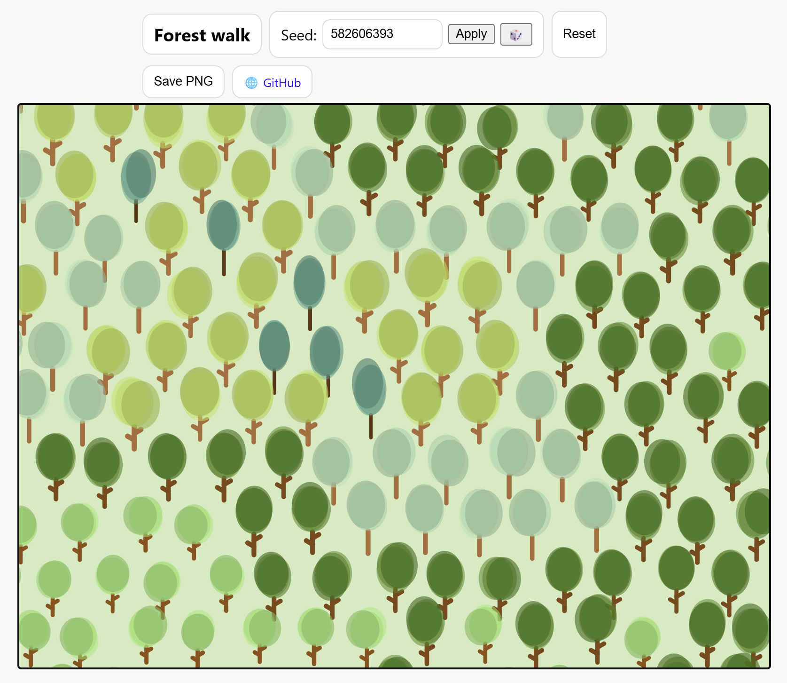

## About me

I'm an EdTech consultant with 25+ years of experience leading digital product strategy, innovation, and large-scale implementations in the K–12 sector. I've spent most of my career at Grupo Planeta, where I've created Aulaplaneta, a curriculum and digital-content platform. I've previously worked as a consultant in Accenture.

I combine deep technical expertise with strong business and educational insight. I've led multidisciplinary teams across technology, pedagogy, UX, analytics, and content production.

---

## Projects

I’ve been working on electronic publishing projects for years. Here are some examples.

- [Aulaplaneta, digital curriculum](http://aulaplaneta.com/)
    - A Spanish k12 digital curriculum used by more than 2,000 schools.

    

- [Editobits blog (2010-2012)](https://editobits.blogspot.com/)
    - A blog about digital publishing, an innovative field long time ago... Co-edited with my coleague Jose Cruz Rodríguez.

- **Multimedia Games**
    - Produced [Aprendilunnis](https://www.youtube.com/watch?v=meWw_-CAyDU), a series of 32 CD-ROMs based on this TV cartoons.

- **Multimedia encyclopedias**
    - Producing multimedia enciclopedias from 2001 to 2013. As a sample [Gran Enciclopedia Hispanica Edición en Red 2014](https://www.youtube.com/watch?v=BRZR2nwg3uA)

- [veintinueve](http://www.veintinueve.com/)
    - Veintinueve was one of the first ebook stores in Spain (2001). Was born to early and [closed in 2002](https://elpais.com/diario/2002/05/28/cultura/1022536802_850215.html)

---

### Home projects

Creative coding. I like to sketch from time to time.

- [Sketches at openprocessing.com](https://openprocessing.org/user/281314/?view=sketches)
    - I'm usign p5.js, the JS version of Processing library.

- [Trembling Trencadis](https://openprocessing.org/crayon/15) was an NFT made for OpenProcessing's [CrayonCodes](https://openprocessing.org/crayon) collection.

- [fxhash](https://www.fxhash.xyz/u/Ricard%20Dalmau)

- Sketches accounts in twitter [@RidalmaSketch ](https://twitter.com/RidalmaSketch) and instagram [ridalma.sketch](https://www.instagram.com/ridalma.sketch/)

- [linktr.ee](https://linktr.ee/ridalma)

---

Other personal hobby projects.

- [Jengax](https://rdalmau.com/jengax/)
    - A a browser-based interactive block-stacking tool inspired by construction logic puzzles. [Github](https://github.com/taganz/jengax) 

        
        
- [Evolution Simulation](https://react-biosim.vercel.app/)
    - An environment to create evolutionary simulations inspired in the great video ['I programmed some creatures. They Evolved'](https://www.youtube.com/watch?v=N3tRFayqVtk), by davidrandallmiller, ported to React by [carlo697](https://github.com/carlo697/react-biosim)  
    - [Github](https://github.com/taganz/react-biosim) 
- [Forest Walk](https://www.rdalmau.com/forest2508/)
    - A generative art project using p5.js that simulates a walk through a procedurally generated forest. Each tree is created with unique DNA, resulting in a diverse and infinite landscape. [Github](https://github.com/taganz/forest2508)

        
        
- [Vic20 Action RPG](https://youtu.be/b3BdMNDb070)
    - An Action RPG written with Victor just for fun
    - [Github](https://github.com/taganz/vic20_rpg) 
    - Next levels coming soon...  :-) 
- [Hacking a Disney R2D2 robot](https://www.youtube.com/watch?v=UKkw1i2dHGM&feature=emb_logo)
    - Adding new functionalities to a small R2D2 toy using Arduino 
    - [Instructables: Hacked Disney R2D2: Bluetooth Control, More Sounds (ESP32, DFPlayer)](https://www.instructables.com/Hacked-Disney-R2D2/)  )
- [A typical obstacle avoiding robot](https://youtu.be/vY8IPSdduss)
    - I'm a Telecommunication Engineer but I haven't been working with electronics for a long long time... This was to revisit electronics. 
- [Terraformer simulation videogame](https://terraformersim.wordpress.com/)
    - Terraformer was a project to build a free educational ecosystem simulation videogame. To much work to finish...

- Artificial life

---

Page template forked from <a href="https://github.com/evanca/quick-portfolio">evanca</a>

<!-- Remove above link if you don't want to attibute -->
